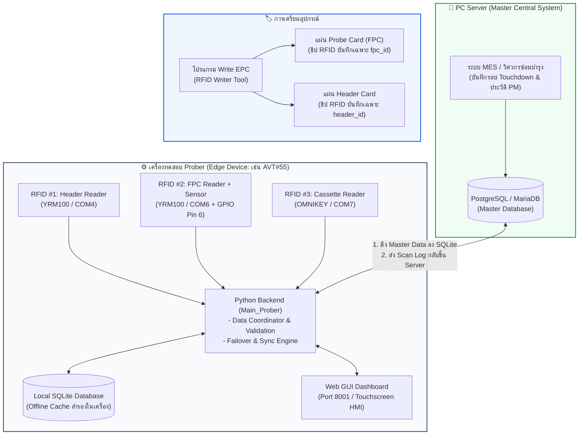
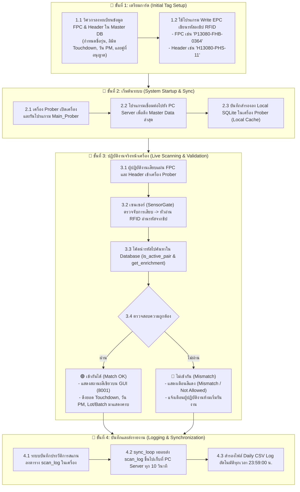
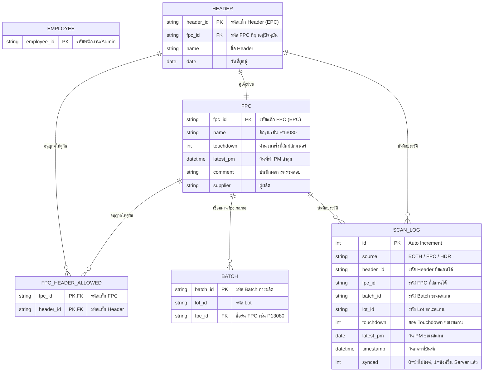

# เอกสารอธิบายการไหลของข้อมูล (RFID Prober Data Flow Architecture)

เอกสารนี้จัดทำขึ้นเพื่ออธิบายภาพรวม สถาปัตยกรรม และโฟลว์การไหลของข้อมูล (**Data Flow**) ในโครงการ **RFID Prober System** ตั้งแต่ขั้นตอนการเตรียมแท็ก การตรวจสอบความถูกต้องหน้างาน ไปจนถึงการซิงค์ข้อมูลระหว่าง **เครื่อง Prober (Local SQLite)** และ **PC Server (PostgreSQL/MariaDB)**

---

## 1. องค์ประกอบหลักในระบบ (System Entities)

---

## 2. โฟลว์การทำงาน 4 ขั้นตอน (End-to-End Data Flow)

---

## 3. รายละเอียดการทำงานของแต่ละขั้นตอน

### ขั้นที่ 1: การเตรียมการ์ด (Initial Tag Setup)

* ชิป RFID บนแผ่นการ์ดจะถูกเก็บเฉพาะ **"รหัสบัตรประจำตัว"** สั้นๆ (EPC ASCII):
  * **แผ่น FPC:** บันทึกรหัส `fpc_id` (เช่น `P13080-FHB-0364`)
  * **แผ่น Header:** บันทึกรหัส `header_id` (เช่น `H13080-PHS-11`)
* ข้อมูลเชิงลึกทั้งหมด (Touchdown, วัน PM, ผู้ผลิต, จำนวน Sites, ล็อตการผลิต) จะถูกลงทะเบียนไว้ใน **ฐานข้อมูลส่วนกลาง (PC Server)**

---

### ขั้นที่ 2: การเริ่มต้นระบบและการซิงค์ข้อมูล (Startup Sync)

* เมื่อเปิดเครื่อง Prober ระบบจะดึง Master Data จาก **PC Server (PostgreSQL/MariaDB)** มาเซฟทับลงใน **SQLite ในเครื่อง**
* **ประโยชน์:** เครื่อง Prober จะมีข้อมูลที่อัปเดตล่าสุดอยู่เสมอ และสามารถทำงานต่อได้ 100% ทันทีแม้ในเวลาที่สาย LAN หลุดหรือเซิร์ฟเวอร์หลักปิดปรับปรุง

---

### ขั้นที่ 3: การสแกนและตรวจสอบหน้างาน (Live Scanning & Validation)

1. **สัญญาณเซนเซอร์ (Gated Reading):** เมื่อเสียบแผ่น FPC ขาเซนเซอร์จะส่งสัญญาณให้เปิด Time Window (8–10 วินาที) เพื่ออ่านแท็ก FPC
2. **การจับคู่ (Pair Matching):** ระบบจะนำรหัส `header_id` และ `fpc_id` ไปเทียบกับตาราง `header` และ `fpc_header_allowed`
3. **การดึงข้อมูลประกอบ (Data Enrichment):**
   * ดึง `touchdown`, `latest_pm`, `comment` จากตาราง `fpc`
   * ดึง `batch_id`, `lot_id` จากตาราง `batch`
4. **การแสดงผลบนหน้าจอ HMI Dashboard (พอร์ต 8001):**
   * **กรณีถูกต้อง (Match OK):** แสดงกรอบสีเขียว พร้อม Touchdown Gauge
   * **กรณีผิดคู่ (Mismatch):** แสดงกรอบสีแดง แจ้งเตือนทันทีเพื่อป้องกันหัวเข็มเสียหาย

---

### ขั้นที่ 4: การบันทึกและส่งรายงาน (Logging & Synchronization)

1. **One-Shot Log Insert:** ระบบจะบันทึกประวัติลงตาราง `scan_log` อย่างแม่นยำ 1 ครั้งต่อ 1 รอบการเสียบการ์ด
2. **Background Sync:** เธรด `sync_loop` จะตรวจสอบรายการที่มี `synced = 0` และส่งผ่าน REST API ขึ้นไปยัง PC Server ทุก 10 วินาที
3. **Daily Backup:** เธรด `BackupManager` จะ Export ข้อมูลการสแกนประจำวันออกมาเป็นไฟล์ `.csv` (Excel-compatible) ตอน 23:59:00 น.

---

## 4. ตารางเปรียบเทียบหน้าที่: PC Server vs SQLite ในเครื่อง

| หัวข้อ                       | PC Server (PostgreSQL / MariaDB)                                                                                                                                                                            | Local SQLite (ประจำเครื่อง Prober)                                                                                              |
| :--------------------------------- | :---------------------------------------------------------------------------------------------------------------------------------------------------------------------------------------------------------- | :------------------------------------------------------------------------------------------------------------------------------------------ |
| **ตำแหน่ง**           | เซิร์ฟเวอร์ส่วนกลางของโรงงาน (IP: 92.121.78.12)                                                                                                                                 | อยู่ในไฟล์`RFID_database_SQLite.db` ในเครื่อง                                                                          |
| **หน้าที่หลัก**   | **Master Database (ฐานข้อมูลแม่)**                                                                                                                                                        | **Edge Cache & Offline Fallback (ฐานข้อมูลสำรอง)**                                                                      |
| **ความสำคัญ**       | เป็นศูนย์กลางที่เก็บข้อมูล FPC ทุกใบในโรงงาน เพื่อให้เครื่อง Prober ทุกเครื่อง (`AVT55`, `AVT56`, ...) เห็นข้อมูลตรงกัน | ช่วยให้เครื่อง Prober ทำงานได้ต่อเนื่องโดยไม่สะดุดแม้ในยาม Network ขัดข้อง         |
| **ทิศทางข้อมูล** | - จ่าย Master Data (FPC/Header/PM) ลงไปให้เครื่อง Prober- รับ Scan Logs จากเครื่อง Prober มาบันทึกยอดรวม                                                       | - รับ Master Data มาอัปเดตแคชในเครื่อง- ส่ง Scan Logs ที่สแกนได้หน้างานขึ้นไปให้ Server |

---

## 5. แผนผังความสัมพันธ์ของตารางข้อมูล (Database Schema ERD)

---

*เอกสารนี้จัดทำและปรับปรุงล่าสุดเมื่อ: 19 สิงหาคม 2026*
